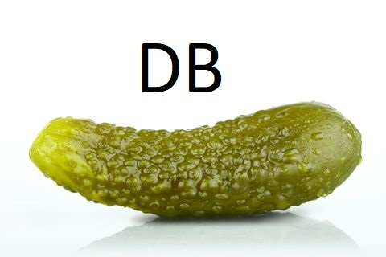

<div id="top"></div>

<!-- PROJECT LOGO -->
<br />
<div align="center">
  <a href="https://github.com/othneildrew/Best-README-Template">
    
  </a>

  <h3 align="center">Mini-Pickle-Database-Framework</h3>

  <p align="center">
    An easy way to build your very own small database!
    <br />
    <!--
    <a href="https://github.com/othneildrew/Best-README-Template"><strong>Explore the docs »</strong></a>
    <br />
    <br />
    <a href="https://github.com/othneildrew/Best-README-Template">View Demo</a>
    ·
    <a href="https://github.com/othneildrew/Best-README-Template/issues">Report Bug</a>
    ·
    <a href="https://github.com/othneildrew/Best-README-Template/issues">Request Feature</a>
    -->
  </p>
</div>


<!-- TABLE OF CONTENTS -->
<details>
  <summary>Table of Contents</summary>
  <ol>
    <li>
      <a href="#about-the-project">About The Project</a>
      <ul>
        <li><a href="#built-with">Built With</a></li>
      </ul>
    </li>
    <li>
      <ul>
        <li><a href="#prerequisites">Prerequisites</a></li>
        <!--
        <li><a href="#installation">Installation</a></li>
        -->
      </ul>
    </li>
    <li><a href="#usage">Usage</a></li>
    <!--
    <li><a href="#roadmap">Roadmap</a></li>
    -->
    <li><a href="#contributing">Contributing</a></li>
    <li><a href="#license">License</a></li>
    <li><a href="#contact">Contact</a></li>
    <li><a href="#acknowledgments">Acknowledgments</a></li>
  </ol>
</details>


<!-- ABOUT THE PROJECT -->
## About The Project

This framework is ...

<p align="right">(<a href="#top">back to top</a>)</p>


### Built With

Below you can find a list of all major frameworks/libraries used to bootstrap this project:

* [Python](https://www.python.org/)
* [Python Pickle](https://docs.python.org/3/library/pickle.html)

<p align="right">(<a href="#top">back to top</a>)</p>


<!-- GETTING STARTED -->

### Prerequisites

* Python version 3.9 or above
* Pickle
* IDE (VS Code, PyCharm, Anaconda, etc.)


<!-- 
Here we will input instructions on the installation of external modules:
* npm
  ```sh
  pip install pickle
  ```
-->

<!-- 

### Installation - Use this shit below if an installation of something is even nesessary: 

_Below is an example of how you can instruct your audience on installing and setting up your app. This template doesn't rely on any external dependencies or services._

<!--
1. Get a free API Key at [https://example.com](https://example.com)
2. Clone the repo
   ```sh
   git clone https://github.com/your_username_/Project-Name.git
   ```
3. Install NPM packages
   ```sh
   npm install
   ```
4. Enter your API in `config.js`
   ```js
   const API_KEY = 'ENTER YOUR API';
   ```

<p align="right">(<a href="#top">back to top</a>)</p>
-->


<!-- USAGE EXAMPLES -->
## Usage

Here is how to framework actually functions: 

1. 
2. 
3. 
4. 
5. 

_For more examples, please refer to the [Documentation](https://docs.python.org/3/library/pickle.html)_

<p align="right">(<a href="#top">back to top</a>)</p>


<!-- ROADMAP - Not sure if we need this shit for now: 

## Roadmap

- [x] Add Changelog
- [x] Add back to top links
- [ ] Add Additional Templates w/ Examples
- [ ] Add "components" document to easily copy & paste sections of the readme
- [ ] Multi-language Support
    - [ ] Chinese
    - [ ] Spanish

See the [open issues](https://github.com/othneildrew/Best-README-Template/issues) for a full list of proposed features (and known issues).

<p align="right">(<a href="#top">back to top</a>)</p>

-->

<!-- CONTRIBUTING -->
## Contributing

Contributions are what make the open source community such an amazing place to learn, inspire, and create. Any contributions you make are **greatly appreciated**.

If you have a suggestion that would make this better, please fork the repo and create a pull request. You can also simply open an issue with the tag "enhancement".
Don't forget to give the project a star! Thanks again!

1. Fork the Project
2. Create your Feature Branch (`git checkout -b feature/AmazingFeature`)
3. Commit your Changes (`git commit -m 'Add some AmazingFeature'`)
4. Push to the Branch (`git push origin feature/AmazingFeature`)
5. Open a Pull Request

<p align="right">(<a href="#top">back to top</a>)</p>


<!-- LICENSE -->
## License

Distributed under the MIT License. See `LICENSE.txt` for more information.

<p align="right">(<a href="#top">back to top</a>)</p>


<!-- CONTACT -->
## Contact

Marin Dragolov - murrou13@gmail.com

Project Link: [https://github.com/murrou-cell/mini_pickle_db](https://github.com/murrou-cell/mini_pickle_db)

<p align="right">(<a href="#top">back to top</a>)</p>


<!-- ACKNOWLEDGMENTS -->
## Acknowledgments

Use this space to list resources you find helpful and would like to give credit to. I've included a few of my favorites to kick things off!

* [Shit I've used 1](link)
* [Shit I've used 2](link)
* [Shit I've used 3](link)
* [Shit I've used 4](link)
* [Shit I've used 5](link)

<p align="right">(<a href="#top">back to top</a>)</p>
